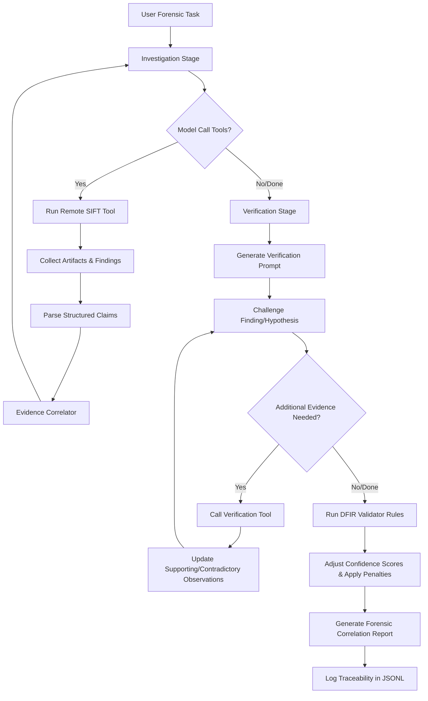

# TriageForce — Autonomous Forensic Triage Agent (Find Evil! Hackathon)

TriageForce is an autonomous incident response and triage agent built for the SANS SIFT Workstation. It leverages the **Google Gemini SDK** and the **Model Context Protocol (MCP)** to securely automate forensic evidence gathering, artifact extraction, and correlation while strictly maintaining evidence integrity.

---

## 🏗️ Technical Architecture

TriageForce enforces security at the architectural level rather than relying solely on prompt-based restrictions.

```
┌─────────────────────────────────────────────────────┐
│                 Local Host (Client)                 │
│              agent.py (Gemini 2.0 Client)           │
└──────────────────────┬──────────────────────────────┘
                       │ SSH stdio tunnel (Passwordless)
                       │ Command: sudo /opt/triageforce/server.py
┌──────────────────────▼──────────────────────────────┐
│         TriageForce MCP Server (FastMCP)             │
│         SIFT VM Virtualenv (Root Context)            │
│                                                      │
│  ┌────────────────┐  ┌────────────────┐             │
│  │  Tool Wrappers │  │ Output Parsers │             │
│  │  (Type-Safe)   │  │ (Structured)   │             │
│  └───────┬────────┘  └───────┬────────┘             │
│          │ subprocess        │ JSON-RPC             │
│  ┌───────▼────────────────────────────┐             │
│  │      SIFT Tool Layer               │             │
│  │  tshark | sha256sum | etc.         │             │
│  └───────────────────────────────────┘             │
│                                                      │
│  ┌───────────────────────────────────┐              │
│  │   Evidence Vault (Read-Only)      │              │
│  │   /cases/case_001/evidence/       │              │
│  │   (ewfmount + read-only bind)     │              │
│  └───────────────────────────────────┘              │
└─────────────────────────────────────────────────────┘
```

### Key Security & Integrity Boundaries:
*   **No Generic Shell Access:** Unlike bridged SSH MCP servers that expose shell access, `server.py` exposes *only* typed, read-only tools (22 total):
    *   `list_case_evidence`: Lists evidence files available in a case directory.
    *   `get_evidence_integrity`: Computes case file hashes (`sha256sum`).
    *   `run_tshark_summary`: Extracts network hierarchy information (`tshark`).
    *   `analyze_prefetch`: Parses Windows Prefetch files (`PECmd`).
    *   `analyze_amcache`: Parses Amcache registry hive (`AmcacheParser`).
    *   `analyze_shimcache`: Parses AppCompatCache / ShimCache (`AppCompatCacheParser`).
    *   `analyze_userassist`: Parses UserAssist registry entries (`RECmd`).
    *   `analyze_recentapps`: Parses RecentApps registry entries (`RECmd`).
    *   `analyze_sysmon`: Parses Sysmon Event Logs (`EvtxECmd`).
    *   `analyze_evtx`: Parses Security, System, or Application logs (`EvtxECmd`).
    *   `analyze_powershell_logs`: Parses PowerShell Event Logs (`EvtxECmd`).
    *   `analyze_usn_journal`: Parses NTFS USN Change Journal (`MFTECmd`).
    *   `analyze_mft`: Parses the $MFT Master File Table (`MFTECmd`).
    *   `analyze_registry_hive`: Parses SYSTEM/SAM/SOFTWARE/SECURITY registry hives (`RECmd`).
    *   `analyze_lnk_files`: Parses Windows shortcut (.lnk) files (`LECmd`).
    *   `analyze_recyclebin`: Parses deleted file metadata from $Recycle.Bin (`RBCmd`).
    *   `analyze_scheduled_tasks`: Parses Windows Scheduled Task XML definitions.
    *   `analyze_services`: Parses Windows services from the SYSTEM registry hive (`RECmd`).
    *   `analyze_sam_users`: Parses local user accounts from the SAM registry hive (`RECmd`).
    *   `analyze_network_connections`: Analyzes PCAP network captures (`tshark`).
    *   `analyze_browser_history`: Parses Chrome/Firefox/IE browser history databases (`sqlite3`).
    *   `analyze_autoruns`: Aggregates all persistence/autorun locations across registry, tasks, services, and startup folders.
    The agent has no mechanism to write files or run arbitrary commands.
*   **Read-Only OS Mounts:** Original E01 disk images are mounted using `ewfmount` to stage a raw volume, which is then bind-mounted read-only at `/cases/case_001/evidence/` via `mount -o remount,ro,bind`.
*   **Logical Consistency Checks:** Every iteration runs check rules inside `agent.py` to identify contradictions (e.g. conflicting hash results, timestamp timezone anomalies, or attempted write actions) and flags them immediately.

---

## 🧠 Self-Correcting DFIR Analyst Loop

TriageForce transforms the simple tool-calling LLM model into a structured, self-correcting DFIR analyst by adding a dual-stage cognitive architecture:



### 1. Evidence Correlation & Objects
Instead of unstructured text, findings are gathered into structured `EvidenceObject` records tracking:
- **Hypothesis Lifecycle**: Assigned a unique identifier (e.g. `H-001`) tracking transition from `hypothesis` to `verified`, `refuted`, or `inconclusive`.
- **Corroborating Sources**: Tracks which tool outputs and SIFT commands contributed to the finding.
- **Observations**: Manages independent lists of `supporting_observations` and `contradictory_observations`.

### 2. Multi-Source Confidence Scoring
Confidence scores (`0.0` - `1.0`) are dynamically computed based on SIFT sources and modifiers:
- **Base Score**: 1 source = `0.25` (Low), 2 independent sources = `0.50` (Medium), 3+ corroborating sources = `0.75` (High).
- **Contradiction Modifier**: `-0.15` per contradictory observation.
- **Verification Modifiers**: Successful verification adds `+0.10`; failed verification subtracts `-0.10`.
- **DFIR Rule Warning**: Deducts `-0.05` per violation.

### 3. Self-Correction Verification Loop
When the model concludes its investigation stage, TriageForce starts a **Verification Stage** bounded by `MAX_VERIFICATION_ITERATIONS = 3` per finding:
- The agent prompts the model to challenge its own findings as a senior validator.
- The model identifies what extra evidence could verify or refute the finding, calls the relevant tools, and outputs a structured `verification_result`.
- Findings are finalized as `verified`, `refuted` (if contradictory evidence outweighs support), or `inconclusive` (if iterations are exhausted without resolution).

### 4. DFIR Knowledge-Driven Validation
Post-verification, the `DFIRValidator` runs industry-standard rules to identify gaps:
- `SINGLE_ARTIFACT`: Flag findings relying on only one source.
- `EXECUTION_CORROBORATION`: Execution claims must check multiple sources (e.g., Prefetch + Amcache).
- `LATERAL_MOVEMENT_CORROBORATION`: Lateral movement must have network + host evidence.
- `PERSISTENCE_CORROBORATION`: Persistence claims require registry + filesystem checks.
- `PRIVILEGE_ESCALATION_CORROBORATION`: Privilege escalation claims require multiple independent sources (e.g., Security Event Log + Sysmon).

### 4.1 Investigation Planning
Before executing tools to investigate a new hypothesis or branch, the agent generates a structured `investigation_plan` representing the hypothesis, required artifacts, tool selection rationale, and expected evidence. This is logged to the audit trail as an `investigation_plan` event.

### 4.2 Forensic Pivot Logic
When a tool returns an error or empty results (e.g. Prefetch directory not found on a Windows XP image), the agent does not abandon the artifact class. Instead, it follows built-in **Forensic Pivot Rules** that redirect it to alternative tools:
- If `analyze_prefetch` fails → pivot to `analyze_mft` with a filename filter for Prefetch artifacts.
- If `analyze_amcache` fails → pivot to `analyze_shimcache` as the primary execution artifact.
- If `analyze_evtx` fails → pivot to `analyze_sysmon` as the alternative event source.
- If `analyze_sysmon` fails → pivot to `analyze_powershell_logs`.

Every pivot is documented in the audit log, ensuring full traceability of which tools were tried and why alternatives were selected.

### 4.3 Forensic Timeline Reconstruction
The `ForensicTimeline` collects timestamped events from tool outputs (Prefetch, Sysmon, EVTX, Amcache, UserAssist, USN Journal, MFT, LNK files, Scheduled Tasks) and normalizes them to UTC. It analyzes them for chronological contradictions (e.g., execution before creation). Any contradiction triggers a penalty to the confidence score of related findings.

### 4.4 MITRE ATT&CK Mapping
The `MitreAttackMapper` automatically maps forensic findings to tactics and techniques of the MITRE ATT&CK framework across all 9 requested tactics: Initial Access, Execution, Persistence, Privilege Escalation, Defense Evasion, Discovery, Lateral Movement, Collection, and Exfiltration. Mappings are stored on the `EvidenceObject` and visualized in the final report.

### 5. Full Execution Traceability
Every phase of the cognitive loop writes detailed, structured logs to `agent_execution.jsonl` tracking events:
- `evidence_created`
- `confidence_update`
- `verification_step`
- `dfir_validation`
- `report_generated`

---

## 🛠️ Environment Configuration

### SIFT Workstation VM Setup
Ensure python virtualenv and custom server script are correctly placed on the SIFT VM:
1. **Server Directory:** `/opt/triageforce/`
2. **Server Python Venv:** `/opt/triageforce/venv/`
3. **Mounted Case Data:** `/cases/case_001/evidence/` (Contains read-only mounted raw file `ewf1`).
4. **Passwordless sudo:** The `sansforensics` user must be configured for passwordless sudo (standard on SIFT workstation VMs) to access the raw evidence files owned by `root`.

### Local Client Setup (Windows Host)
1. **Configure SSH Keys:** Establish passwordless SSH connection to the SIFT VM (`ssh-copy-id sansforensics@192.168.255.128`).
2. **Set API Key:** Create a `.env` file in the root directory of this repository and populate your Gemini API Key:
    ```env
    GEMINI_API_KEY="your-gemini-api-key-here"
    ```
3. **Register MCP in IDE (Optional):** Run the PowerShell setup script to automatically write the custom `triageforce` server profile to your IDE config (`~/.gemini/config/mcp_config.json`):
    ```powershell
    .\setup-mcp.ps1
    ```

---

## 🚀 Usage

Install dependencies:
```bash
pip install -r requirements.txt
```

### 1. Run Connection Diagnostic
Run the pre-flight connection test to validate the Gemini API authentication, SSH authentication, remote python venv, and MCP tool discovery:
```bash
python agent.py --test-connection
```

### 2. Start Triage Task
Launch the autonomous forensic agent to investigate case files:
```bash
python agent.py --task "Generate a list of case evidence files and compile a protocol hierarchy summary of the network pcap"
```

### 3. Review Audit Logs
Every session writes detailed, structured JSONL trace logs to `agent_execution.jsonl` tracking iterations, token counts, tool calls, and consistency outcomes for evaluation.
